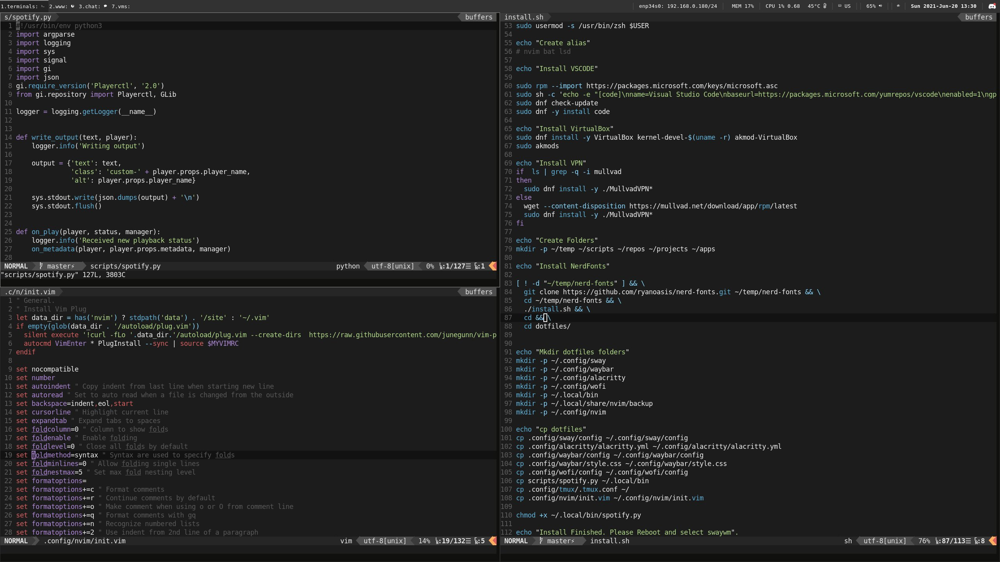

# dotfiles ?

TODO:
- krew
- alias
- install excluding DE

Simple dotfiles for:
- nvim
- tmux
- bashrc
- zshrc
- extras

---
## Shortcuts
### Vim

- zo - open single fold
- zR - open all folds
- zc - close single fold
- zM - close all folds
- ctrl+v + shift I + wtv + ESC - Multi cursor write

### Tmux
* Meta - Alt
* Ctrl B - Default  --> cb

Change layout - cb + space

Rename window - cb + ,

New window - cb + c

Manual resize - cb + hold ctrl and move with arrows
